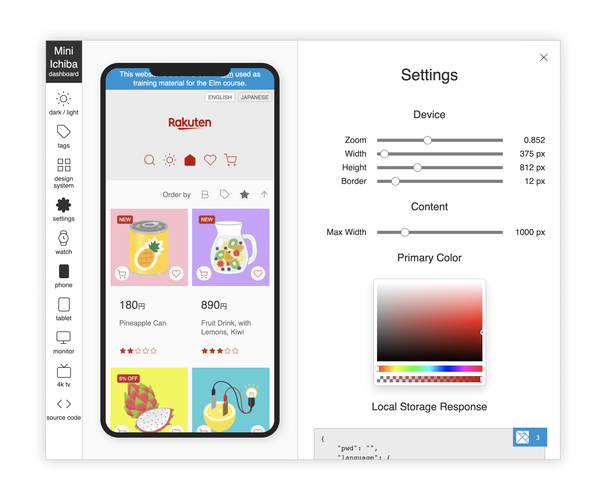

# elm-rakuten-mini-ichiba

This is a small E-commerce demo applications built with [Elm](https://elm-lang.org/).



It is made of

```
2,500 lines of Elm
   25 lines of JavaScript
   15 lines of HTML
    0 lines of CSS
```

Elm is a domain-specific purely functional language that compiles to JavaScript

Elm guarantees:

* No runtime exception.
* 100% immutable data.
* 100% pure functions, also in dependencies.
* 100% type inference.
* [Etc.](https://discourse.elm-lang.org/t/what-are-your-favorite-things-about-elm/6947?u=lucamug)

These characteristics make the code robust, performant, and simpler to comprehend and maintain.

## Characteristics of this demo

* Responsive
* Cart and Favorites management
* Persistent (Local storage)
* Light / Dark mode
* Bilingual
* Search and Sort
* Fault tolerant
* Atomic design
* Dashboard (+1,100 lines of Elm)

## Links

* [Mini-Ichiba](https://rj7b6.surge.sh)
* [Dashboard](https://z4uqv.surge.sh)
* [Code (Ellie)](https://ellie-app.com/f4LmXfNShbfa1)
* [Code (git)](https://tinyurl.com/83pnwzt3)

## Prerequisites

* Install **[Git](https://git-scm.com/downloads)**
* Install **[Node.js](https://nodejs.org/en/download/)**
* Install these other applications with these commands:

```
> npm i -g elm
> npm i -g elm-go
> npm i -g elm-formatter
> npm i -g terser
```

## To setup the development environment

```
git clone https://git.rakuten-it.com/scm/elm/elm-rakuten-mini-ichiba.git
cd elm-rakuten-mini-ichiba
```

## To develop the main application

```
cmd/start
```

Then access http://localhost:8000/

Edit `src/Main.elm` and the browser will update automatically.

## To develop the Dashboard

```
cmd/startDashboard
```

Then access http://localhost:8001/

Edit `src/Dashboard.elm` and the browser will update automatically.

## To build an optimized version

```
cmd/build
```

This will crate two folders, `build/normal` and `build/dashboard` containing an optimized version of the applications. You can use these to publish the application.

Here is how the optimized versions look like:

* https://rj7b6.surge.sh (Mini-Ichiba)
* https://z4uqv.surge.sh (Mini-Ichiba with Dashboard)

Use "rakuten" if a password is requested.

## More info

More info at https://confluence.rakuten-it.com/confluence/x/7smNmw

# **❤️😃 HAPPY CODING! 😃❤️**